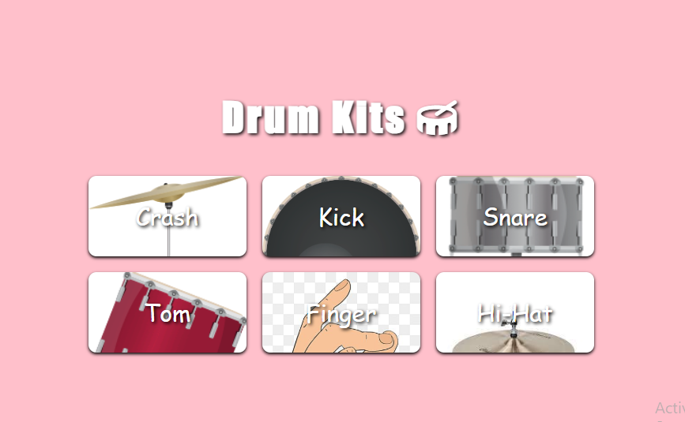

# 🥁 Drum Kits Project

A dynamic and interactive web-based Drum Kit application built using native web technologies. This project allows users to play different drum sounds either by clicking the interactive buttons on the screen or by pressing the corresponding keys on their keyboard.

## 🚀 Live Demo
[Live Demo Link](https://mohab-elhashem.github.io/Drum-Kits/)

## 📸 Preview

---

## 🛠️ Features & Skills Demonstrated

This project showcases a solid foundation in frontend development, utilizing essential HTML5, CSS3, and Vanilla JavaScript concepts.

### 1. HTML5 & Custom Layouts
* Fully structured semantic markup to support dynamic element generation.

### 2. CSS3 Styling & Responsiveness
* Clean and interactive UI utilizing essential CSS properties:
  * `box-shadow` for depth and modern card designs.
  * `letter-spacing` and `white-space` for precise typography control.
* **User Feedback:** Implementation of micro-interactions using `:hover` and `:active` pseudo-classes to mimic physical button presses.
* **Responsive Design:** Utilized CSS **Media Queries** to ensure a seamless experience across mobile, tablet, and desktop screens.

### 3. JavaScript (ES6+) & DOM Manipulation
The core functionality is driven by Vanilla JS, demonstrating the following skills:
* **DOM Selection & Creation:** Efficient use of `querySelector`, dynamic element generation with `createElement`, and structural updates using `appendChild`.
* **Dynamic Styling:** Modifying element styles directly through JavaScript based on user interactions.
* **Data Structures & Iteration:** Storing kits data in **Arrays** and iterating through them using the `forEach` method.
* **Asynchronous Logic:** Utilizing `setTimeout` to manage timed animations and state resets (e.g., button press effects).
* **Event Handling:** Implementing multi-input support by listening to both `click` and `keydown` events.
* **String Manipulation:** Leveraging built-in string methods like `.slice()` and `.toUpperCase()` for clean data formatting and UI rendering.

---

## 📂 Project Structure
```text
├── index.html
├── style.css
└── script.js
